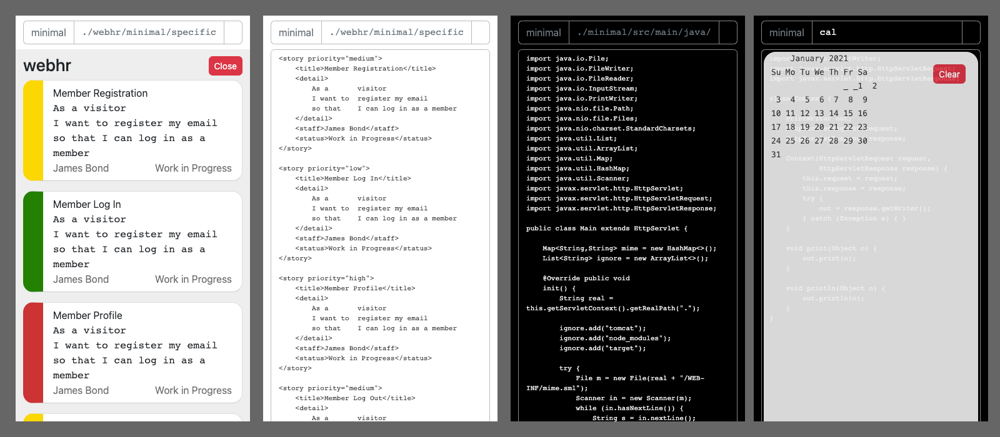

# minimal

โครงการนี้ชื่อว่า minimal เป็นการสร้างระบบพัฒนา Software 
ตามแนวคิด Software Engineering รองรับ Software ทุกชนิด 
เพราะใช้ Fundamental Activity ตั้งแต่ Software Specification 
มีระบบการเขียน Requirement แบบ XML แสดงผลเข้าใจได้ง่าย 
ปรับแก้ข้อมูลแล้วลง Git หรือ Version Control ได้ทันที

ใช้ได้บนอุปกรณ์ทุกชนิด ทั้ง iPhone, iPad และ Computer ทุกระบบ 
ผู้ใช้ไม่ต้องติดตั้งอะไรทั้งสิ้น ใช้ Web Browser ทั่วไป 
Build Project ที่ต้องการได้ทันที

ลองไป Clone และสร้าง Pull Request 
กันได้ที่นี่ https://github.com/kookiatsuetrong/minimal

The project “minimal” is an integrated development 
environment that follows software engineering process. 
It supports all type of software, starting from 
software specification. It accepts requirements 
in XML format so all requirements can store in 
Git or any version control system.

It can run on any modern web browser, on iPhone, 
iPad and a computer. No additional software to download, 
just open the web browser and build any project from minimal.

Try to clone and create a pull request from here: 
https://github.com/kookiatsuetrong/minimal

